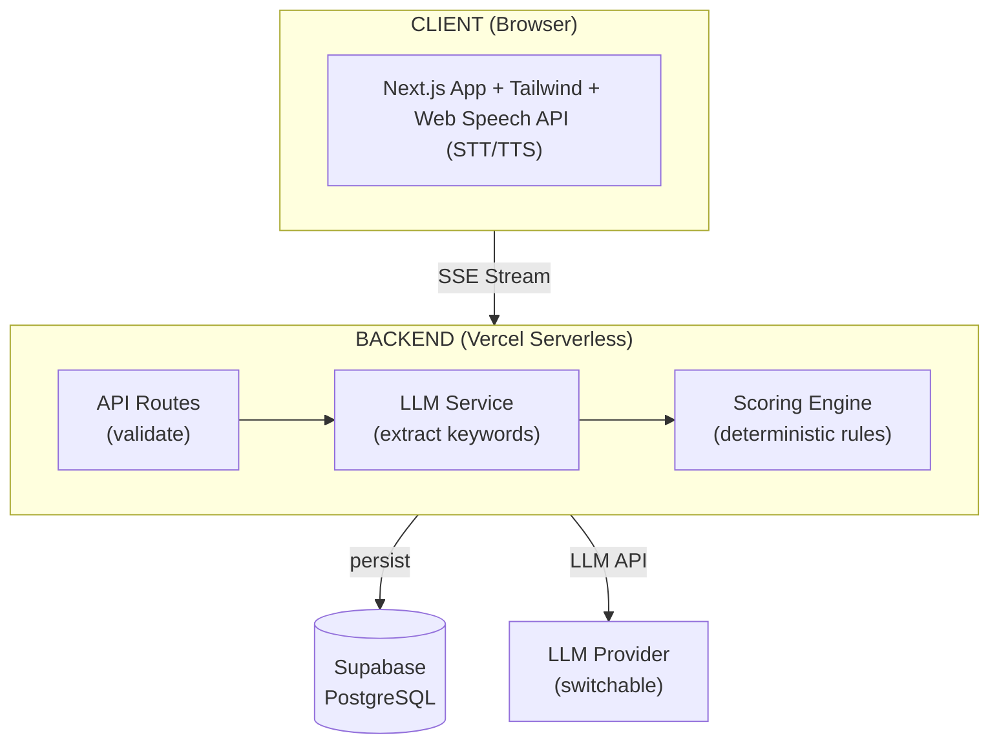

# SICAPS

**Smart AI System for Scabies Screening**

Web-based chatbot that performs preliminary scabies screening through interactive conversation — extracting clinical keywords, calculating risk scores, and providing personalized recommendations.

---

## About SICAPS

Scabies is a highly contagious skin disease commonly found in high-density environments such as Islamic boarding schools (pesantren). Limited access to medical professionals causes many cases to go undetected or receive delayed treatment.

SICAPS provides an accessible preliminary screening solution. Through natural conversation with an AI chatbot, the system:

1. **Explores symptoms** adaptively (itch intensity, timing, body locations, contact history, skin lesions, risk factors)
2. **Extracts clinical keywords** from user responses using LLM
3. **Calculates risk scores** deterministically on the backend (not by AI)
4. **Generates output** including risk level (High/Moderate/Low), perception response, action recommendations, and personalized care advice

This project is part of dr. Erlina Wijayanti's research at Yarsi University, targeting screening accuracy of ≥80% compared to clinical diagnosis by physicians.

---

## Features (MVP — Phase 1)

- Interactive AI chat with adaptive conversation flow (not rigid Q&A)
- Voice input (Speech-to-Text) + voice output (Text-to-Speech) via Web Speech API
- Keyword extraction by LLM + deterministic scoring engine on backend
- Questionnaire mode as fallback when AI is offline
- Bilingual — Bahasa Indonesia + English
- Risk level output + 4-part personalized results
- PDF download of screening results (with Yarsi header)
- Shareable result link
- Anonymous screening (no login required)

---

## Tech Stack

| Layer      | Technology                                                |
| ---------- | --------------------------------------------------------- |
| Frontend   | Next.js 16 (App Router), React 19, Tailwind CSS, Radix UI |
| Backend    | Next.js API Routes (serverless)                           |
| Database   | Supabase (PostgreSQL)                                     |
| ORM        | Prisma                                                    |
| LLM        | Qwen2.5-7B-Instruct via OpenAI-compatible SDK             |
| Voice      | Web Speech API (browser native STT + TTS)                 |
| i18n       | next-intl                                                 |
| PDF        | @react-pdf/renderer                                       |
| Deployment | Vercel + Supabase                                         |

---

## Architecture



Key design decision: **LLM only extracts keywords; backend calculates scores.** This ensures deterministic and reproducible scoring for research purposes.

---

## Getting Started

> ⚠️ Project is currently in documentation and design phase. Source code implementation has not started.

### Prerequisites

- Node.js 18+
- npm or yarn
- [Ollama](https://ollama.com/) (for local LLM development)
- Supabase account (database)

### Setup (once implementation begins)

```bash
# 1. Clone & install
git clone https://github.com/Yarsi-ai/sicaps.git
cd sicaps
npm install

# 2. Configure environment
cp .env.example .env.local
# Edit .env.local — see docs/phase-1/LLM_INTEGRATION.md for details

# 3. Setup database
npx prisma generate
npx prisma db push

# 4. Start local LLM
ollama pull qwen2.5:7b
ollama serve

# 5. Run development server
npm run dev
```

### Environment Variables

| Variable       | Description                                    |
| -------------- | ---------------------------------------------- |
| `DATABASE_URL` | Supabase PostgreSQL connection string          |
| `LLM_BASE_URL` | LLM provider endpoint (Ollama/HuggingFace/etc) |
| `LLM_API_KEY`  | Provider API key                               |
| `LLM_MODEL`    | Model identifier (default: `qwen2.5:7b`)       |

Full list: see `.env.example` (will be available when implementation starts).

---

## Documentation

Complete documentation available at [`docs/`](./docs/README.md):

| Category      | Documents                                                                                  |
| ------------- | ------------------------------------------------------------------------------------------ |
| **Product**   | [PRD](./docs/PRD.md) — user stories, scoring rules, roadmap                                |
| **Technical** | [Technical Spec](./docs/TECHNICAL_SPEC.md) — architecture, project structure              |
| **AI Bot**    | [AI Bot Spec](./docs/phase-1/AI_BOT_SPEC.md) — persona, conversation flow, extraction      |
| **Scoring**   | [Scoring Engine](./docs/phase-1/SCORING_ENGINE_SPEC.md) — matching algorithm, keyword pool |
| **LLM**       | [LLM Integration](./docs/phase-1/LLM_INTEGRATION.md) — streaming, fallback, cost           |
| **API**       | [API Spec](./docs/phase-1/API_SPEC.md) — endpoints, schemas, error codes                   |
| **Design**    | [Design Spec](./docs/phase-1/DESIGN_SPEC.md) — UI/UX, visual styles                        |
| **Database**  | [Schema](./docs/DATABASE_SCHEMA.md) — Prisma models, indexes, RLS                          |

---

## Development Roadmap

### Phase 1 — MVP _(current)_

Anonymous screening, AI chat + questionnaire fallback, bilingual (ID/EN). Deploy to Vercel + Supabase.

### Phase 2 — Auth & Roles

Login/register, role management (Admin, Doctor, Cadre), role-based dashboards, image-based assessment (custom CV model).

### Phase 3 — Enhancement

Real-time statistics, interactive outbreak maps, push notifications, PWA offline support, migration to self-deployed LLM.

---

## Contributing

This project is currently developed within an internal research context. Contributions through coordination with the team.

Before contributing, read:

- [Coding Standards](./docs/CODING_STANDARDS.md) — architecture rules, naming, testing, git conventions
- [Documentation Index](./docs/README.md) — overview of all documentation

### Git Conventions

```
feat(scoring): add longest-match priority algorithm
fix(chat): handle empty extraction gracefully
docs(readme): add getting started section
```

---

## License

This project is licensed under the MIT License - see the [LICENSE](LICENSE) file for details.

---

## Authors

- **dr. Erlina Wijayanti** — Research Lead, Yarsi University
- **Mufid Farhan Muhana** — Software Engineer

---

_SICAPS — Yarsi University, 2026_
