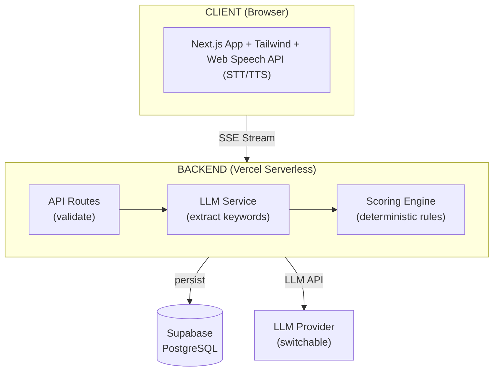

# SICAPS

**Sistem Cerdas AI untuk Pemeriksaan Skabies**

Web-based chatbot yang melakukan skrining awal skabies melalui percakapan interaktif — mengekstrak keyword klinis, menghitung skor risiko, dan memberikan rekomendasi yang dipersonalisasi.

---

## Tentang SICAPS

Skabies merupakan penyakit kulit menular yang sangat umum ditemukan di lingkungan padat seperti pondok pesantren. Keterbatasan akses terhadap tenaga medis menyebabkan banyak kasus tidak terdeteksi atau terlambat ditangani.

SICAPS hadir sebagai solusi skrining awal yang mudah diakses. Melalui percakapan natural dengan chatbot AI, sistem ini:

1. **Menggali gejala** secara adaptive (intensitas gatal, waktu, lokasi tubuh, riwayat kontak, lesi kulit, faktor risiko)
2. **Mengekstrak keyword klinis** dari jawaban user menggunakan LLM
3. **Menghitung skor risiko** secara deterministik di backend (bukan oleh AI)
4. **Menghasilkan output** berupa level risiko (Tinggi/Sedang/Rendah), respons persepsi, rekomendasi aksi, dan saran penanganan personal

Proyek ini merupakan bagian dari penelitian dr. Widjayanti di Universitas YARSI, dengan target akurasi skrining ≥ 80% dibandingkan diagnosis klinis dokter.

---

## Features (MVP — Fase 1)

- Chat AI interaktif dengan adaptive conversation flow (bukan rigid Q&A)
- Voice input (Speech-to-Text) + voice output (Text-to-Speech) via Web Speech API
- Keyword extraction oleh LLM + scoring engine deterministik di backend
- Questionnaire mode sebagai fallback jika AI offline
- Bilingual — Bahasa Indonesia + English
- Risk level output + 4 bagian hasil personalisasi
- PDF download hasil screening (dengan header YARSI)
- Shareable result link
- Anonymous screening (no login required)

---

## Tech Stack

| Layer      | Technology                                                |
| ---------- | --------------------------------------------------------- |
| Frontend   | Next.js 16 (App Router), React 19, Tailwind CSS, Radix UI |
| Backend    | Next.js API Routes (serverless)                           |
| Database   | Supabase (PostgreSQL)                                     |
| ORM        | Prisma                                                    |
| LLM        | Qwen2.5-7B-Instruct via OpenAI-compatible SDK             |
| Voice      | Web Speech API (browser native STT + TTS)                 |
| i18n       | next-intl                                                 |
| PDF        | @react-pdf/renderer                                       |
| Deployment | Vercel + Supabase                                         |

---

## Architecture



Key design decision: **LLM hanya extract keyword, backend yang hitung skor.** Ini memastikan scoring deterministik dan reproducible untuk keperluan riset.

---

## Getting Started

> ⚠️ Project sedang dalam fase dokumentasi dan desain. Implementasi source code belum dimulai.

### Prerequisites

- Node.js 18+
- npm atau yarn
- [Ollama](https://ollama.com/) (untuk local LLM development)
- Supabase account (database)

### Setup (once implementation begins)

```bash
# 1. Clone & install
git clone <repo-url>
cd sicaps
npm install

# 2. Configure environment
cp .env.example .env.local
# Edit .env.local — lihat docs/phase-1/LLM_INTEGRATION.md untuk detail

# 3. Setup database
npx prisma generate
npx prisma db push

# 4. Start local LLM
ollama pull qwen2.5:7b
ollama serve

# 5. Run development server
npm run dev
```

### Environment Variables

| Variable       | Description                                    |
| -------------- | ---------------------------------------------- |
| `DATABASE_URL` | Supabase PostgreSQL connection string          |
| `LLM_BASE_URL` | LLM provider endpoint (Ollama/HuggingFace/etc) |
| `LLM_API_KEY`  | Provider API key                               |
| `LLM_MODEL`    | Model identifier (default: `qwen2.5:7b`)       |

Full list: lihat `.env.example` (akan tersedia saat implementation dimulai).

---

## Documentation

Dokumentasi lengkap tersedia di [`docs/`](./docs/README.md):

| Category      | Documents                                                                                  |
| ------------- | ------------------------------------------------------------------------------------------ |
| **Product**   | [PRD](./docs/PRD.md) — user stories, scoring rules, roadmap                                |
| **Technical** | [Technical Spec](./docs/phase-1/TECHNICAL_SPEC.md) — architecture, project structure       |
| **AI Bot**    | [AI Bot Spec](./docs/phase-1/AI_BOT_SPEC.md) — persona, conversation flow, extraction      |
| **Scoring**   | [Scoring Engine](./docs/phase-1/SCORING_ENGINE_SPEC.md) — matching algorithm, keyword pool |
| **LLM**       | [LLM Integration](./docs/phase-1/LLM_INTEGRATION.md) — streaming, fallback, cost           |
| **API**       | [API Spec](./docs/phase-1/API_SPEC.md) — endpoints, schemas, error codes                   |
| **Design**    | [Design Spec](./docs/phase-1/DESIGN_SPEC.md) — UI/UX, visual styles                        |
| **Database**  | [Schema](./docs/DATABASE_SCHEMA.md) — Prisma models, indexes, RLS                          |

---

## Development Roadmap

### Fase 1 — MVP _(current)_

Skrining anonim, chat AI + questionnaire fallback, bilingual (ID/EN). Deploy ke Vercel + Supabase.

### Fase 2 — Auth & Roles

Login/register, role management (Admin, Dokter, Kader), dashboard per role, image-based assessment (custom CV model).

### Fase 3 — Enhancement

Statistik real-time, peta sebaran interaktif, notifikasi push, PWA offline, migrasi ke self-deployed LLM.

---

## Contributing

Project ini saat ini dikembangkan dalam konteks riset internal. Kontribusi melalui koordinasi dengan tim.

Sebelum berkontribusi, baca:

- [Coding Standards](./docs/CODING_STANDARDS.md) — architecture rules, naming, testing, git conventions
- [Documentation Index](./docs/README.md) — overview seluruh dokumentasi

### Git Conventions

```
feat(scoring): add longest-match priority algorithm
fix(chat): handle empty extraction gracefully
docs(readme): add getting started section
```

---

## License

TBD — Keputusan lisensi berada di bawah kewenangan Universitas YARSI.

---

## Authors

- **dr. Widjayanti** — Research Lead, Universitas YARSI
- **[Developer]** — Software Engineer

---

_SICAPS — Universitas YARSI, 2026_
