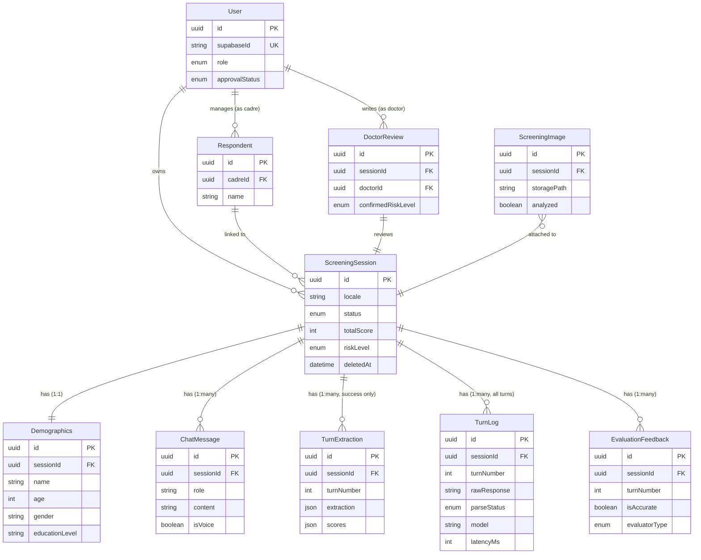

# SICAPS — Database Schema

> **Reference:** [PRD.md](./PRD.md) | [TECHNICAL_SPEC.md](./TECHNICAL_SPEC.md) | [AI_BOT_SPEC.md](./phase-1/AI_BOT_SPEC.md)  
> **Database:** PostgreSQL (Supabase)  
> **ORM:** Prisma  
> **Last updated:** 23 Juni 2026

---

## 1. Overview

Dokumen ini adalah **single source of truth** untuk desain database SICAPS. Mencakup schema definition, indexing strategy, RLS policies, data retention, dan migration roadmap.

### 1.1 Conventions

| Layer          | Convention                               | Contoh               |
| -------------- | ---------------------------------------- | -------------------- |
| Prisma model   | PascalCase                               | `ScreeningSession`   |
| Prisma field   | camelCase                                | `totalScore`         |
| Prisma enum    | SCREAMING_SNAKE                          | `IN_PROGRESS`        |
| DB table name  | snake_case (via `@@map`)                 | `screening_session`  |
| DB column name | snake_case (via `@map`)                  | `total_score`        |
| Primary key    | UUID v4                                  | `@default(uuid())`   |
| Timestamps     | `createdAt` + `updatedAt` (jika mutable) | `DateTime`           |
| Soft delete    | `deletedAt` nullable timestamp           | Hanya di root entity |

### 1.2 Design Principles

- **JSON (JSONB) untuk data fleksibel** — extraction, scores, dan array categories disimpan sebagai JSONB. Riset dilakukan via export, bukan direct SQL query pada nested data.
- **Soft delete di root entity saja** — `deletedAt` hanya di `ScreeningSession`. Child records mengikuti parent; hard purge menggunakan `ON DELETE CASCADE`.
- **Derived data yang di-query disimpan** — `totalScore` dan `riskLevel` disimpan untuk indexing/filtering. `chatTheme` di-derive runtime dari `educationLevel`.
- **Locale di session, bukan demographics** — bahasa mempengaruhi seluruh sesi, bukan hanya profil responden.
- **Data permanen untuk riset** — tidak ada auto-expiry. Privacy ditangani via anonimitas.

---

## 2. Entity Relationship Diagram



---

## 3. Enums

```prisma
enum Role {
  ADMIN
  DOCTOR
  CADRE
  USER
  ANONYMOUS
}

enum ApprovalStatus {
  PENDING
  APPROVED
  REJECTED
}

enum RiskLevel {
  LOW
  MODERATE
  HIGH
}

enum Perception {
  UNDERESTIMATE
  OVERESTIMATE
  BARRIER
  ADEQUATE
}

enum ScreeningStatus {
  IN_PROGRESS
  COMPLETED
  REVIEWED
}

enum EvaluatorType {
  DEVELOPER
  DOCTOR
  RESEARCHER
}

enum ParseStatus {
  SUCCESS
  PARTIAL
  FAILURE
}

enum ReviewAction {
  REFER_CLINIC
  EDUCATE
  OTHER
}
```

**DB mapping:** Prisma enums disimpan sebagai PostgreSQL native enum types.

---

## 4. MVP Tables

### 4.1 ScreeningSession

Root entity untuk setiap sesi screening. **Definisi ini hanya mencakup fields dan relations MVP.**

```prisma
model ScreeningSession {
  id                  String          @id @default(uuid()) @map("id")

  // Session config
  locale              String          @default("id") @map("locale") // "id" | "en"
  mode                String          @default("ai") @map("mode")   // "ai" | "questionnaire"
  status              ScreeningStatus @default(IN_PROGRESS) @map("status")
  source              String          @default("production") @map("source") // "production" | "testing" | "playground"

  // Adaptive flow state
  categoriesCovered   Json            @default("[]") @map("categories_covered")
  // Type: string[] — contoh: ["intensitas", "waktu", "lokasi_tubuh"]

  // Final scoring (derived, stored for indexing)
  scores              Json?           @map("scores")
  // Type: { intensitas: number, waktu: number, lokasi_tubuh: number, kontak: number, lesi: number, faktor_risiko: number }
  totalScore          Int?            @map("total_score")
  riskLevel           RiskLevel?      @map("risk_level")
  perception          Perception?     @map("perception")

  // AI Output (4 bagian)
  aiConclusion        String?         @map("ai_conclusion")
  aiPerceptionResponse String?        @map("ai_perception_response")
  aiRecommendation    String?         @map("ai_recommendation")
  aiSuggestion        String?         @map("ai_suggestion")

  // Sharing
  shareToken          String?         @unique @default(uuid()) @map("share_token")

  // Versioning (audit trail)
  promptVersion       String          @default("v1") @map("prompt_version")
  scoringVersion      String          @default("v1") @map("scoring_version")

  // Timestamps & soft delete
  createdAt           DateTime        @default(now()) @map("created_at")
  completedAt         DateTime?       @map("completed_at")
  updatedAt           DateTime        @updatedAt @map("updated_at")
  deletedAt           DateTime?       @map("deleted_at")

  // Relations (MVP)
  messages            ChatMessage[]
  extractions         TurnExtraction[]
  turnLogs            TurnLog[]
  evaluationFeedbacks EvaluationFeedback[]
  demographics        Demographics?

  @@index([status, riskLevel], map: "idx_session_status_risk")
  @@index([shareToken], map: "idx_session_share_token")
  @@index([createdAt(sort: Desc)], map: "idx_session_created_desc")
  @@index([riskLevel, createdAt(sort: Desc)], map: "idx_session_risk_created")
  @@map("screening_session")
}
```

**Catatan:**

- `mode` — `"ai"` (default, LLM available) atau `"questionnaire"` (degraded, LLM unavailable). Diupdate saat degradation terjadi mid-session.
- `source` — `"production"` (dari fitur utama) atau `"testing"` (dari console testing). Digunakan untuk filter export CSV. Default "production" supaya existing data tidak terpengaruh.
- `categoriesCovered` — tracking real-time kategori yang sudah filled. Diupdate setiap turn.
- `scores` — JSON object skor per kategori (rich format: {raw, capped, status}). Hanya diisi saat screening COMPLETED.
- `totalScore` + `riskLevel` — denormalized dari `scores` untuk indexing/filtering.
- `promptVersion` — versi system prompt yang digunakan saat sesi ini berjalan. Untuk audit trail.
- `scoringVersion` — versi scoring engine/pattern table yang digunakan. Untuk reproducibility riset.
- `deletedAt` — soft delete. NULL = active, timestamp = deleted.
- `chatTheme` **tidak disimpan** — selalu derive dari `demographics.educationLevel`.

**Fields ditambahkan di Fase 2 (lihat §5):**

- `userId` — FK ke User (MVP selalu null / anonim)
- `isIncognito` — toggle incognito mode
- Relasi ke `User`, `DoctorReview`, `ScreeningImage`

---

### 4.2 Demographics

Data demografi responden. Relasi 1:1 dengan ScreeningSession.

```prisma
model Demographics {
  id              String            @id @default(uuid()) @map("id")
  sessionId       String            @unique @map("session_id")

  // Fields (dari pre-chat form)
  name            String?           @map("name")
  age             Int               @map("age")
  gender          String            @map("gender")        // "male" | "female"
  educationLevel  String            @map("education_level")
  // Values: "elementary" | "junior_high" | "senior_high" | "university"

  createdAt       DateTime          @default(now()) @map("created_at")

  // Relations
  session         ScreeningSession  @relation(fields: [sessionId], references: [id], onDelete: Cascade)

  @@map("demographics")
}
```

**Catatan:**

- `educationLevel` menentukan nada bahasa AI: `elementary` → playful (kasual, emoji), lainnya → hybrid (sopan, minimal emoji). Visual UI tetap sama untuk semua.
- `name` opsional — user boleh tidak mengisi.
- `gender` disimpan sebagai string (bukan enum) untuk fleksibilitas internasional.
- Tidak ada field `language` — locale disimpan di `ScreeningSession.locale`.

---

### 4.3 ChatMessage

Full chat transcript. Setiap bubble (user atau bot) = 1 row.

```prisma
model ChatMessage {
  id          String           @id @default(uuid()) @map("id")
  sessionId   String           @map("session_id")

  role        String           @map("role")    // "assistant" | "user"
  content     String           @map("content")
  isVoice     Boolean          @default(false) @map("is_voice")

  createdAt   DateTime         @default(now()) @map("created_at")

  // Relations
  session     ScreeningSession @relation(fields: [sessionId], references: [id], onDelete: Cascade)

  @@index([sessionId, createdAt], map: "idx_message_session_time")
  @@map("chat_message")
}
```

**Catatan:**

- `isVoice` — true jika input berasal dari STT (voice), berguna untuk riset perbandingan voice vs text.
- Maks ~14 messages per session (7 turns × 2). Volume sangat kecil.
- Ordering: `createdAt ASC` untuk menampilkan chat berurutan.

---

### 4.4 TurnExtraction

Extraction data yang **schema-valid** — safe untuk scoring engine. Hanya dibuat saat LLM response pass full Zod schema validation (`parseStatus = SUCCESS`).

```prisma
model TurnExtraction {
  id          String           @id @default(uuid()) @map("id")
  sessionId   String           @map("session_id")
  turnNumber  Int              @map("turn_number")

  // Validated extraction output (JSONB) — guaranteed complete 6 categories
  extraction  Json             @map("extraction")
  // Type: {
  //   intensitas: [{ keyword: string, confidence: "high"|"medium"|"low" }],
  //   waktu: [...],
  //   lokasi_tubuh: [...],
  //   kontak: [...],
  //   lesi: [...],
  //   faktor_risiko: [...]
  // }

  // Skor hasil matching backend (JSONB)
  scores      Json             @map("scores")
  // Type: { intensitas: CategoryScore, waktu: CategoryScore, ... }

  createdAt   DateTime         @default(now()) @map("created_at")

  // Relations
  session     ScreeningSession @relation(fields: [sessionId], references: [id], onDelete: Cascade)

  @@unique([sessionId, turnNumber], map: "uq_extraction_session_turn")
  @@map("turn_extraction")
}
```

**Catatan:**

- `@@unique([sessionId, turnNumber])` — mencegah duplikat turn dalam 1 session.
- **HANYA dibuat saat parse SUCCESS** — scoring engine aman membaca semua records tanpa defensive checks.
- `extraction` — guaranteed memiliki semua 6 kategori sebagai arrays (bisa kosong tapi pasti ada).
- `scores` — snapshot skor per kategori dari turn ini (bukan kumulatif).

---

### 4.5 TurnLog

Audit trail untuk **semua turn** (success, partial, failure). Menyimpan raw LLM response dan metadata. Untuk observability dan prompt evaluation — BUKAN untuk scoring.

```prisma
model TurnLog {
  id            String           @id @default(uuid())
  sessionId     String           @map("session_id")
  turnNumber    Int              @map("turn_number")

  // User message that triggered this LLM call
  userMessage   String           @map("user_message")  @db.Text

  // Raw LLM response (full JSON string, regardless of validity)
  rawResponse   String           @map("raw_response")  @db.Text

  // Parse result
  parseStatus   ParseStatus      @map("parse_status")  // SUCCESS | PARTIAL | FAILURE
  parseError    String?          @map("parse_error")   // Error message if parse failed

  // System prompt used for this turn (stored for prompt version comparison)
  systemMessage String           @map("system_message") @db.Text

  // LLM call metadata
  model         String                                  // e.g., "llama-3.1-8b-instant"
  promptVersion String           @map("prompt_version") // e.g., "v1"
  latencyMs     Int              @map("latency_ms")
  tokenUsage    Json?            @map("token_usage")   // { input: number, output: number }
  retryCount    Int              @default(0) @map("retry_count")

  // Playground-specific metadata (null for production/testing turns)
  metadata      Json?            @map("metadata")
  // Type (when source='playground'): {
  //   source: "playground",
  //   provider: string,
  //   temperature: number,
  //   topP: number,
  //   maxTokens: number,
  //   customSystemPrompt: boolean,
  //   mode: "single-shot" | "multi-turn" | "compare"
  // }

  createdAt     DateTime         @default(now()) @map("created_at")

  // Relations
  session       ScreeningSession @relation(fields: [sessionId], references: [id], onDelete: Cascade)

  @@unique([sessionId, turnNumber], map: "uq_turnlog_session_turn")
  @@index([parseStatus], map: "idx_turnlog_parse_status")
  @@index([model], map: "idx_turnlog_model")
  @@map("turn_logs")
}
```

**Catatan:**

- **Selalu dibuat** — setiap turn (success/partial/failure) pasti punya 1 TurnLog record.
- `userMessage` — pesan user yang trigger LLM call ini. Disimpan di sini juga untuk kemudahan export tanpa JOIN ke ChatMessage.
- `rawResponse` — full JSON string yang dikembalikan LLM. Bisa invalid JSON pada failure case.
- `parseStatus` — menentukan apakah turn ini juga punya `TurnExtraction` record (hanya SUCCESS).
- `parseError` — error message saat parse gagal (null jika success).
- `systemMessage` — full system prompt yang digunakan. Disimpan untuk membandingkan kinerja antar prompt version.
- `onDelete` — saat ini menggunakan default Restrict (bukan Cascade). Akan ditambahkan Cascade di corrective migration mendatang.
- Scoring engine **TIDAK pernah membaca** tabel ini — hanya test page dan export.
- **Planned indexes** (belum di-migrate): `@@unique([sessionId, turnNumber])`, `@@index([parseStatus])`, `@@index([model])`. Akan ditambahkan saat volume data meningkat.

---

### 4.6 EvaluationFeedback

Feedback akurasi per turn dari developer/dokter/researcher. Untuk membangun gold dataset.

```prisma
model EvaluationFeedback {
  id            String        @id @default(uuid())
  sessionId     String        @map("session_id")
  turnNumber    Int           @map("turn_number")

  evaluatorType EvaluatorType @map("evaluator_type")  // required, no default
  isAccurate    Boolean       @map("is_accurate")
  notes         String?       @db.Text                // alasan kenapa tidak akurat
  promptVersion String        @map("prompt_version")  // versi prompt saat evaluasi

  createdAt     DateTime      @default(now()) @map("created_at")
  updatedAt     DateTime      @updatedAt @map("updated_at")

  // Relations
  session       ScreeningSession @relation(fields: [sessionId], references: [id], onDelete: Cascade)

  @@unique([sessionId, turnNumber, evaluatorType])
  @@index([promptVersion], map: "idx_feedback_prompt_version")
  @@index([evaluatorType, isAccurate], map: "idx_feedback_evaluator_accuracy")
  @@map("evaluation_feedbacks")
}
```

**Catatan:**

- `@@unique([sessionId, turnNumber, evaluatorType])` — satu evaluator hanya bisa kasih 1 feedback per turn. Upsert untuk update.
- `evaluatorType` — **required tanpa default**. Caller harus explicitly provide tipe evaluator.
- `updatedAt` — otomatis diupdate saat feedback di-upsert.
- `promptVersion` — disimpan dari session saat feedback diberi, untuk grouping di export.
- Satu turn bisa punya multiple feedback (developer + doctor) — inter-rater agreement.
- `notes` — free text, opsional. Berguna untuk mencatat "harusnya extract X tapi miss" atau "hallucinated keyword Y".
- `onDelete` — saat ini menggunakan default Restrict (bukan Cascade). Akan ditambahkan Cascade di corrective migration mendatang.
- **Planned indexes** (belum di-migrate): `@@index([promptVersion])`, `@@index([evaluatorType, isAccurate])`. Akan ditambahkan saat volume data meningkat.

---

## 5. Fase 2 Tables (Planned)

> **Status:** Belum diimplementasi. Definisi di bawah adalah rancangan awal yang bisa berubah saat Fase 2 dimulai.

### 5.0 Alterations ke ScreeningSession (Fase 2)

Fields berikut ditambahkan ke `ScreeningSession` saat Fase 2:

```prisma
// Tambahan field di ScreeningSession (Fase 2)
  userId              String?         @map("user_id") // FK ke User, null = anonim
  isIncognito         Boolean         @default(false) @map("is_incognito")

// Tambahan relations
  user                User?           @relation(fields: [userId], references: [id])
  review              DoctorReview?
  images              ScreeningImage[]

// Tambahan index
  @@index([userId], map: "idx_session_user_id")
```

### 5.1 User

```prisma
model User {
  id              String         @id @default(uuid()) @map("id")
  supabaseId      String         @unique @map("supabase_id")
  email           String?        @unique @map("email")
  name            String?        @map("name")
  role            Role           @default(USER) @map("role")
  approvalStatus  ApprovalStatus @default(PENDING) @map("approval_status")

  createdAt       DateTime       @default(now()) @map("created_at")
  updatedAt       DateTime       @updatedAt @map("updated_at")
  deletedAt       DateTime?      @map("deleted_at")

  // Relations
  sessions        ScreeningSession[]
  reviews         DoctorReview[]
  respondents     Respondent[]

  @@index([role, approvalStatus], map: "idx_user_role_approval")
  @@map("user")
}
```

### 5.2 DoctorReview

```prisma
model DoctorReview {
  id                  String           @id @default(uuid()) @map("id")
  sessionId           String           @unique @map("session_id")
  doctorId            String           @map("doctor_id")

  confirmedRiskLevel  RiskLevel?       @map("confirmed_risk_level")
  action              ReviewAction?    @map("action")
  notes               String?          @map("notes")
  overrideSuggestion  String?          @map("override_suggestion")

  createdAt           DateTime         @default(now()) @map("created_at")

  // Relations
  session             ScreeningSession @relation(fields: [sessionId], references: [id], onDelete: Cascade)
  doctor              User             @relation(fields: [doctorId], references: [id])

  @@index([doctorId], map: "idx_review_doctor")
  @@map("doctor_review")
}
```

### 5.3 Respondent

Data santri/peserta yang dikelola oleh kader.

```prisma
model Respondent {
  id              String    @id @default(uuid()) @map("id")
  cadreId         String    @map("cadre_id")

  name            String    @map("name")
  age             Int?      @map("age")
  gender          String?   @map("gender")
  notes           String?   @map("notes")

  createdAt       DateTime  @default(now()) @map("created_at")
  updatedAt       DateTime  @updatedAt @map("updated_at")
  deletedAt       DateTime? @map("deleted_at")

  // Relations
  cadre           User      @relation(fields: [cadreId], references: [id])
  sessions        ScreeningSession[]

  @@index([cadreId], map: "idx_respondent_cadre")
  @@map("respondent")
}
```

### 5.4 ScreeningImage

Upload foto kulit untuk analisis CV model.

```prisma
model ScreeningImage {
  id              String           @id @default(uuid()) @map("id")
  sessionId       String           @map("session_id")

  storagePath     String           @map("storage_path")
  fileName        String           @map("file_name")
  mimeType        String           @map("mime_type")  // "image/jpeg" | "image/png" | "image/webp"
  fileSize        Int              @map("file_size")  // bytes

  // Analysis result
  analyzed        Boolean          @default(false) @map("analyzed")
  detectedLesions Boolean?         @map("detected_lesions")
  lesionTypes     Json?            @map("lesion_types")  // LesionType[]
  confidence      Float?           @map("confidence")    // 0-100
  conclusion      String?          @map("conclusion")    // "supports_scabies" | "does_not_support" | "inconclusive"
  rawResult       Json?            @map("raw_result")    // full model response

  consentGiven    Boolean          @default(false) @map("consent_given")
  createdAt       DateTime         @default(now()) @map("created_at")

  // Relations
  session         ScreeningSession @relation(fields: [sessionId], references: [id], onDelete: Cascade)

  @@index([sessionId], map: "idx_image_session")
  @@map("screening_image")
}
```

### 5.5 CadreLocation (Planned — Fase 2)

Profil lokasi pondok yang melekat ke kader.

```prisma
model CadreLocation {
  id              String    @id @default(uuid()) @map("id")
  cadreId         String    @unique @map("cadre_id")

  provinceId      String    @map("province_id")
  provinceName    String    @map("province_name")
  regencyId       String    @map("regency_id")
  regencyName     String    @map("regency_name")
  districtId      String?   @map("district_id")
  districtName    String?   @map("district_name")
  villageId       String?   @map("village_id")
  villageName     String?   @map("village_name")

  institutionName String?   @map("institution_name")  // Nama pondok/institusi
  residenceDuration String? @map("residence_duration") // "<6mo" | "6-12mo" | "1-2yr" | ">2yr"
  roomOccupants   Int?      @map("room_occupants")

  createdAt       DateTime  @default(now()) @map("created_at")
  updatedAt       DateTime  @updatedAt @map("updated_at")

  // Relations
  cadre           User      @relation(fields: [cadreId], references: [id])

  @@map("cadre_location")
}
```

---

## 6. Indexing Strategy

### 6.1 MVP Indexes

| Tabel                  | Index                                       | Tipe          | Status      | Alasan                                     |
| ---------------------- | ------------------------------------------- | ------------- | ----------- | ------------------------------------------ |
| `screening_session`    | `(status, risk_level)`                      | btree         | ✅ Migrated | Filter antrian dokter                      |
| `screening_session`    | `(share_token)`                             | btree, unique | ✅ Migrated | Public result lookup                       |
| `screening_session`    | `(created_at DESC)`                         | btree         | ✅ Migrated | Sorting terbaru                            |
| `screening_session`    | `(risk_level, created_at DESC)`             | btree         | ✅ Migrated | Antrian dokter: "skor ≥ MODERATE, terbaru" |
| `chat_message`         | `(session_id, created_at)`                  | btree         | ✅ Migrated | Transcript berurutan                       |
| `turn_extraction`      | `(session_id, turn_number)`                 | btree, unique | ✅ Migrated | Prevent duplicate + lookup                 |
| `turn_logs`            | `(session_id, turn_number)`                 | btree, unique | ✅ Migrated | Prevent duplicate + lookup                 |
| `turn_logs`            | `(parse_status)`                            | btree         | ✅ Migrated | Filter by parse result                     |
| `turn_logs`            | `(model)`                                   | btree         | ✅ Migrated | Filter by LLM model                        |
| `evaluation_feedbacks` | `(session_id, turn_number, evaluator_type)` | btree, unique | ✅ Migrated | Prevent duplicate per evaluator            |
| `evaluation_feedbacks` | `(prompt_version)`                          | btree         | ✅ Migrated | Group by prompt version for comparison     |
| `evaluation_feedbacks` | `(evaluator_type, is_accurate)`             | btree         | ✅ Migrated | Accuracy stats per evaluator               |
| `demographics`         | `(session_id)`                              | btree, unique | ✅ Migrated | 1:1 lookup (implicit dari `@unique`)       |

### 6.2 Fase 2 Indexes

| Tabel               | Index                     | Alasan                                        |
| ------------------- | ------------------------- | --------------------------------------------- |
| `screening_session` | `(user_id)`               | FK lookup (nullable di MVP, populated Fase 2) |
| `user`              | `(role, approval_status)` | Filter pending approvals                      |
| `doctor_review`     | `(doctor_id)`             | List reviews per dokter                       |
| `respondent`        | `(cadre_id)`              | List respondent per kader                     |
| `screening_image`   | `(session_id)`            | Images per session                            |

### 6.3 Index yang Sengaja TIDAK Ditambahkan

| Field                      | Alasan                                          |
| -------------------------- | ----------------------------------------------- |
| `demographics.age`         | Volume kecil, full scan cukup cepat             |
| `demographics.gender`      | Low cardinality (2 values), index tidak efektif |
| `chat_message.content`     | Tidak ada fitur search chat                     |
| `screening_session.locale` | Hanya 2 values, filter jarang dipakai sendiri   |

---

## 7. Row Level Security (RLS) Policies

### 7.1 Prinsip

- MVP: semua operasi scoring/chat lewat **API routes (service role)**. Client hanya direct-access untuk operasi minimal.
- Fase 2: tambah per-role policies.

### 7.2 MVP Policies

```sql
-- ==================== screening_session ====================

-- Anyone can start a screening (INSERT via anon key)
CREATE POLICY "anon_insert_session"
  ON screening_session FOR INSERT
  TO anon
  WITH CHECK (true);

-- Public can view result via shareToken
CREATE POLICY "public_view_by_token"
  ON screening_session FOR SELECT
  TO anon
  USING (share_token = current_setting('request.headers')::json->>'x-share-token');

-- Service role full access (API routes)
CREATE POLICY "service_full_access"
  ON screening_session FOR ALL
  TO service_role
  USING (true)
  WITH CHECK (true);

-- ==================== demographics ====================

-- Anyone can insert demographics (paired with session start)
CREATE POLICY "anon_insert_demographics"
  ON demographics FOR INSERT
  TO anon
  WITH CHECK (true);

-- Only service role can read
CREATE POLICY "service_read_demographics"
  ON demographics FOR SELECT
  TO service_role
  USING (true);

-- ==================== chat_message ====================

-- Service role only (all operations go through API)
CREATE POLICY "service_only_messages"
  ON chat_message FOR ALL
  TO service_role
  USING (true)
  WITH CHECK (true);

-- ==================== turn_extraction ====================

-- Service role only
CREATE POLICY "service_only_extraction"
  ON turn_extraction FOR ALL
  TO service_role
  USING (true)
  WITH CHECK (true);

-- ==================== turn_log ====================

-- Service role only (observability data)
CREATE POLICY "service_only_turn_log"
  ON turn_log FOR ALL
  TO service_role
  USING (true)
  WITH CHECK (true);

-- ==================== evaluation_feedback ====================

-- Service role only (feedback submitted via internal API)
CREATE POLICY "service_only_feedback"
  ON evaluation_feedback FOR ALL
  TO service_role
  USING (true)
  WITH CHECK (true);
```

### 7.3 Fase 2 Policies (Planned)

| Tabel               | Role               | Access                                                                   |
| ------------------- | ------------------ | ------------------------------------------------------------------------ |
| `screening_session` | Authenticated user | SELECT own sessions (`user_id = auth.uid()`)                             |
| `screening_session` | Doctor (approved)  | SELECT sessions with `risk_level >= MODERATE` AND `is_incognito = false` |
| `screening_session` | Cadre (approved)   | SELECT sessions linked to own respondents                                |
| `screening_session` | Admin              | SELECT all                                                               |
| `doctor_review`     | Doctor             | INSERT/UPDATE own reviews                                                |
| `respondent`        | Cadre              | CRUD own respondents (`cadre_id = auth.uid()`)                           |
| `screening_image`   | Doctor             | SELECT images for sessions in review queue                               |

---

## 8. Data Retention & Privacy

### 8.1 Retention Policy

| Data                     | Retention                  | Alasan                                   |
| ------------------------ | -------------------------- | ---------------------------------------- |
| Session anonim           | Permanen                   | Data riset — inti penelitian             |
| Session user logged in   | Permanen                   | User bisa request soft delete via akun   |
| Session incognito        | Permanen (tanpa `user_id`) | Riset, tapi tidak muncul di riwayat akun |
| Chat messages            | Mengikuti parent session   | Cascade soft/hard delete                 |
| TurnExtraction           | Mengikuti parent session   | Audit trail riset                        |
| Shareable link           | Tidak expired              | Selama session ada, link aktif           |
| Uploaded images (Fase 2) | Permanen                   | Bisa di-request hapus oleh user          |

### 8.2 Privacy by Design

- **MVP sepenuhnya anonim** — tidak ada field identitas kuat (email, phone). `name` opsional dan bisa diisi sembarang.
- **Tidak ada IP logging** di level aplikasi.
- **Data medis** ditangani sebagai data riset, bukan catatan medis formal (tidak terikat RM/rekam medis).
- **Consent** — untuk image upload (Fase 2), consent popup wajib sebelum upload.
- **Hak hapus** — user bisa request hapus data via soft delete. Hard purge dijadwalkan periodik oleh admin.

### 8.3 Soft Delete Implementation

```typescript
// Prisma middleware for automatic filtering
prisma.$use(async (params, next) => {
  // Automatically filter soft-deleted sessions
  if (params.model === 'ScreeningSession') {
    if (params.action === 'findMany' || params.action === 'findFirst') {
      params.args.where = {
        ...params.args.where,
        deletedAt: null,
      };
    }
  }
  return next(params);
});

// Soft delete operation
async function softDeleteSession(sessionId: string) {
  return prisma.screeningSession.update({
    where: { id: sessionId },
    data: { deletedAt: new Date() },
  });
}

// Hard purge (admin scheduled job)
async function purgeDeletedSessions(olderThanDays: number = 30) {
  const cutoff = new Date();
  cutoff.setDate(cutoff.getDate() - olderThanDays);

  // CASCADE will delete children automatically
  return prisma.screeningSession.deleteMany({
    where: {
      deletedAt: { not: null, lt: cutoff },
    },
  });
}
```

---

## 9. JSON Field Schemas

Dokumentasi struktur JSONB fields untuk consistency.

### 9.1 `ScreeningSession.categoriesCovered`

```typescript
type CategoriesCovered = string[];
// Contoh: ["intensitas", "waktu", "lokasi_tubuh"]
// Valid values: "intensitas" | "waktu" | "lokasi_tubuh" | "kontak" | "lesi" | "faktor_risiko"
```

### 9.2 `ScreeningSession.scores`

```typescript
interface CategoryScore {
  raw: number; // sebelum floor (bisa negatif jika negative keyword)
  capped: number; // setelah floor 0
  status: 'assessed' | 'not_assessed'; // not_assessed = kategori belum sempat ditanya (force-close)
}

interface Scores {
  intensitas: CategoryScore;
  waktu: CategoryScore;
  lokasi_tubuh: CategoryScore;
  kontak: CategoryScore;
  lesi: CategoryScore;
  faktor_risiko: CategoryScore;
}

// Contoh:
// {
//   "intensitas": { "raw": 2, "capped": 2, "status": "assessed" },
//   "waktu": { "raw": 2, "capped": 2, "status": "assessed" },
//   "lokasi_tubuh": { "raw": 2, "capped": 2, "status": "assessed" },
//   "kontak": { "raw": -2, "capped": 0, "status": "assessed" },
//   "lesi": { "raw": 0, "capped": 0, "status": "not_assessed" },
//   "faktor_risiko": { "raw": 4, "capped": 4, "status": "assessed" }
// }
```

> **Note:** API response mengembalikan flat numbers (hanya `capped` values) untuk simplicity frontend. Format rich ini hanya di-persist di database untuk audit trail dan riset.

### 9.3 `TurnExtraction.extraction`

```typescript
interface Extraction {
  intensitas: ExtractedKeyword[];
  waktu: ExtractedKeyword[];
  lokasi_tubuh: ExtractedKeyword[];
  kontak: ExtractedKeyword[];
  lesi: ExtractedKeyword[];
  faktor_risiko: ExtractedKeyword[];
}

interface ExtractedKeyword {
  keyword: string;
  confidence: 'high' | 'medium' | 'low';
}

// Contoh:
// {
//   "intensitas": [{ "keyword": "gatal hebat", "confidence": "high" }],
//   "waktu": [{ "keyword": "malam hari", "confidence": "medium" }],
//   "lokasi_tubuh": [],
//   "kontak": [{ "keyword": "teman sekamar", "confidence": "low" }],
//   "lesi": [],
//   "faktor_risiko": []
// }
```

### 9.4 `TurnExtraction.scores`

```typescript
interface TurnScores {
  intensitas: CategoryScore;
  waktu: CategoryScore;
  lokasi_tubuh: CategoryScore;
  kontak: CategoryScore;
  lesi: CategoryScore;
  faktor_risiko: CategoryScore;
}
// Rich format per turn — includes raw, capped, status, matchedPatterns.
// Backend menjumlahkan semua capped scores untuk mendapat total akhir.
```

### 9.5 `TurnLog.tokensUsed`

```typescript
interface TokensUsed {
  input: number; // prompt tokens
  output: number; // completion tokens
}
// Null jika provider tidak mengembalikan usage data.
```

### 9.6 `TurnLog.rawResponse`

```typescript
// String — full JSON yang dikembalikan LLM (bisa invalid JSON pada failure case)
// Contoh (success):
// '{"reply":"Terima kasih...","extraction":{"intensitas":[...],...},"categories_covered":[...],...}'
// Contoh (partial):
// '{"reply":"Baik, saya mengerti..."}'
// Contoh (failure):
// 'Sorry, I cannot help with that. <invalid>'
```

---

## 10. Migration Roadmap

### 10.1 MVP (Fase 1)

```bash
# Initial migration — create all MVP tables
npx prisma migrate dev --name init_mvp

# Tables created:
# - screening_session
# - demographics
# - chat_message
# - turn_extraction

# Observability tables (llm-hardening spec)
npx prisma migrate dev --name add_observability

# Tables created:
# - turn_log
# - evaluation_feedback
# Enums added:
# - EvaluatorType (DEVELOPER, DOCTOR, RESEARCHER)
# - ParseStatus (SUCCESS, PARTIAL, FAILURE)
```

**Seeding:** Tidak diperlukan. Data tercipta organik dari screening sessions.

### 10.2 Fase 2 — Auth & Roles

```bash
npx prisma migrate dev --name add_auth_roles

# Tables created:
# - user
# - doctor_review
# - respondent
# - cadre_location
# - screening_image

# Alterations:
# - screening_session: user_id FK → user.id (nullable, existing rows tetap null)
# - screening_session: add respondent_id FK (nullable)
```

**Migrasi data:** Semua session MVP tetap anonim (`user_id = null`). Tidak ada data migration yang perlu dijalankan.

### 10.3 Fase 3 — Enhancement

```bash
npx prisma migrate dev --name add_analytics

# Possible additions:
# - Materialized views untuk statistik
# - Normalized keyword table (jika JSONB query jadi bottleneck)
# - Notification queue table
```

---

## 11. Supabase Storage (Non-DB)

Untuk file yang disimpan di Supabase Storage (bukan PostgreSQL):

| Bucket             | Akses         | Konten          | Fase   |
| ------------------ | ------------- | --------------- | ------ |
| `screening-images` | Private (RLS) | Foto kulit user | Fase 2 |

**Path format:** `{sessionId}/{timestamp}-{index}.{ext}`  
**Constraint:** Maks 5 file/session, maks 10MB/file, format JPEG/PNG/WebP.

---

## 12. Useful JSONB Queries (Reference)

Meskipun riset utama via export, berikut contoh query yang bisa dijalankan langsung:

```sql
-- Total sessions per risk level
SELECT risk_level, COUNT(*)
FROM screening_session
WHERE deleted_at IS NULL AND status = 'COMPLETED'
GROUP BY risk_level;

-- Rata-rata skor per kategori
SELECT
  AVG((scores->>'intensitas')::int) as avg_intensitas,
  AVG((scores->>'waktu')::int) as avg_waktu,
  AVG((scores->>'lokasi_tubuh')::int) as avg_lokasi,
  AVG((scores->>'kontak')::int) as avg_kontak,
  AVG((scores->>'lesi')::int) as avg_lesi,
  AVG((scores->>'faktor_risiko')::int) as avg_faktor
FROM screening_session
WHERE deleted_at IS NULL AND status = 'COMPLETED';

-- Sessions per bulan
SELECT
  DATE_TRUNC('month', created_at) as month,
  COUNT(*) as total,
  COUNT(*) FILTER (WHERE risk_level = 'HIGH') as high_risk
FROM screening_session
WHERE deleted_at IS NULL AND status = 'COMPLETED'
GROUP BY month
ORDER BY month DESC;

-- Export full session data (untuk riset)
SELECT
  ss.id, ss.total_score, ss.risk_level, ss.perception, ss.locale,
  ss.scores, ss.created_at, ss.completed_at,
  d.age, d.gender, d.education_level
FROM screening_session ss
JOIN demographics d ON d.session_id = ss.id
WHERE ss.deleted_at IS NULL AND ss.status = 'COMPLETED'
ORDER BY ss.created_at DESC;

-- Parse success rate per model (prompt evaluation)
SELECT
  model,
  COUNT(*) as total_turns,
  COUNT(*) FILTER (WHERE parse_status = 'SUCCESS') as success,
  COUNT(*) FILTER (WHERE parse_status = 'PARTIAL') as partial,
  COUNT(*) FILTER (WHERE parse_status = 'FAILURE') as failure,
  ROUND(100.0 * COUNT(*) FILTER (WHERE parse_status = 'SUCCESS') / COUNT(*), 1) as success_rate_pct
FROM turn_log
GROUP BY model;

-- Accuracy rate per prompt version (dari feedback)
SELECT
  ef.prompt_version,
  COUNT(*) as total_evaluated,
  COUNT(*) FILTER (WHERE ef.is_accurate = true) as accurate,
  ROUND(100.0 * COUNT(*) FILTER (WHERE ef.is_accurate = true) / COUNT(*), 1) as accuracy_pct
FROM evaluation_feedback ef
GROUP BY ef.prompt_version
ORDER BY ef.prompt_version;

-- Average latency per model
SELECT
  model,
  ROUND(AVG(latency_ms)) as avg_latency_ms,
  ROUND(PERCENTILE_CONT(0.95) WITHIN GROUP (ORDER BY latency_ms)) as p95_latency_ms
FROM turn_log
GROUP BY model;
```

---

## 13. Prisma Full Schema (MVP)

File lengkap untuk `prisma/schema.prisma` (MVP only):

```prisma
generator client {
  provider = "prisma-client-js"
}

datasource db {
  provider = "postgresql"
  url      = env("DATABASE_URL")
}

// ==================== ENUMS ====================

enum RiskLevel {
  LOW
  MODERATE
  HIGH
}

enum Perception {
  UNDERESTIMATE
  OVERESTIMATE
  BARRIER
  ADEQUATE
}

enum ScreeningStatus {
  IN_PROGRESS
  COMPLETED
  REVIEWED
}

// ==================== SCREENING SESSION ====================

model ScreeningSession {
  id                   String          @id @default(uuid()) @map("id")
  locale               String          @default("id") @map("locale")
  mode                 String          @default("ai") @map("mode") // "ai" | "questionnaire"
  status               ScreeningStatus @default(IN_PROGRESS) @map("status")
  categoriesCovered    Json            @default("[]") @map("categories_covered")
  scores               Json?           @map("scores")
  totalScore           Int?            @map("total_score")
  riskLevel            RiskLevel?      @map("risk_level")
  perception           Perception?     @map("perception")
  aiConclusion         String?         @map("ai_conclusion")
  aiPerceptionResponse String?         @map("ai_perception_response")
  aiRecommendation     String?         @map("ai_recommendation")
  aiSuggestion         String?         @map("ai_suggestion")
  shareToken           String?         @unique @default(uuid()) @map("share_token")
  promptVersion        String          @default("v1") @map("prompt_version")
  scoringVersion       String          @default("v1") @map("scoring_version")
  createdAt            DateTime        @default(now()) @map("created_at")
  completedAt          DateTime?       @map("completed_at")
  updatedAt            DateTime        @updatedAt @map("updated_at")
  deletedAt            DateTime?       @map("deleted_at")

  messages             ChatMessage[]
  extractions          TurnExtraction[]
  demographics         Demographics?

  @@index([status, riskLevel], map: "idx_session_status_risk")
  @@index([shareToken], map: "idx_session_share_token")
  @@index([createdAt(sort: Desc)], map: "idx_session_created_desc")
  @@index([riskLevel, createdAt(sort: Desc)], map: "idx_session_risk_created")
  @@map("screening_session")
}

// ==================== DEMOGRAPHICS ====================

model Demographics {
  id             String           @id @default(uuid()) @map("id")
  sessionId      String           @unique @map("session_id")
  name           String?          @map("name")
  age            Int              @map("age")
  gender         String           @map("gender")
  educationLevel String           @map("education_level")
  createdAt      DateTime         @default(now()) @map("created_at")

  session        ScreeningSession @relation(fields: [sessionId], references: [id], onDelete: Cascade)

  @@map("demographics")
}

// ==================== CHAT MESSAGES ====================

model ChatMessage {
  id        String           @id @default(uuid()) @map("id")
  sessionId String           @map("session_id")
  role      String           @map("role")
  content   String           @map("content")
  isVoice   Boolean          @default(false) @map("is_voice")
  createdAt DateTime         @default(now()) @map("created_at")

  session   ScreeningSession @relation(fields: [sessionId], references: [id], onDelete: Cascade)

  @@index([sessionId, createdAt], map: "idx_message_session_time")
  @@map("chat_message")
}

// ==================== TURN EXTRACTION ====================

model TurnExtraction {
  id          String           @id @default(uuid()) @map("id")
  sessionId   String           @map("session_id")
  turnNumber  Int              @map("turn_number")
  extraction  Json             @map("extraction")
  scores      Json             @map("scores")
  llmMetadata Json?            @map("llm_metadata")
  createdAt   DateTime         @default(now()) @map("created_at")

  session     ScreeningSession @relation(fields: [sessionId], references: [id], onDelete: Cascade)

  @@unique([sessionId, turnNumber], map: "uq_extraction_session_turn")
  @@map("turn_extraction")
}
```
