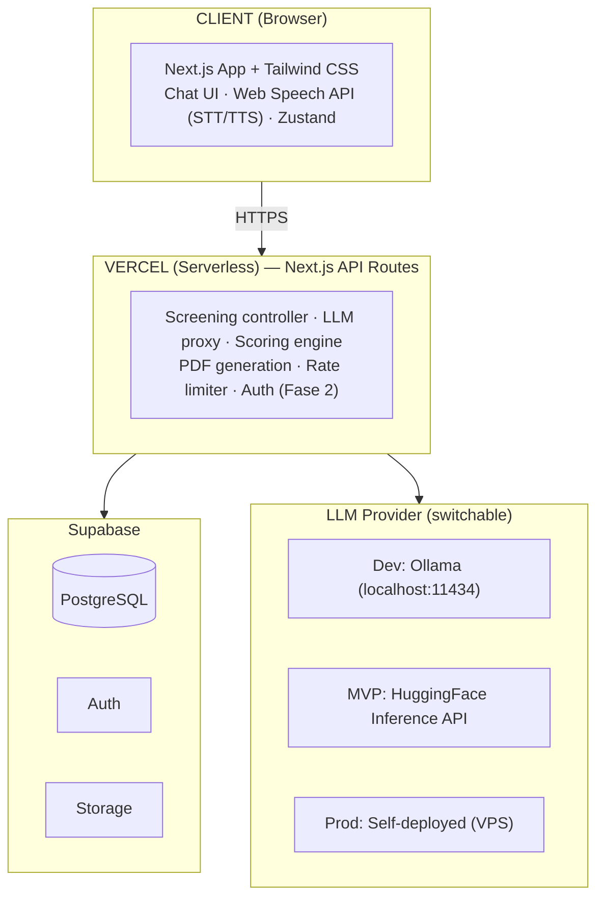
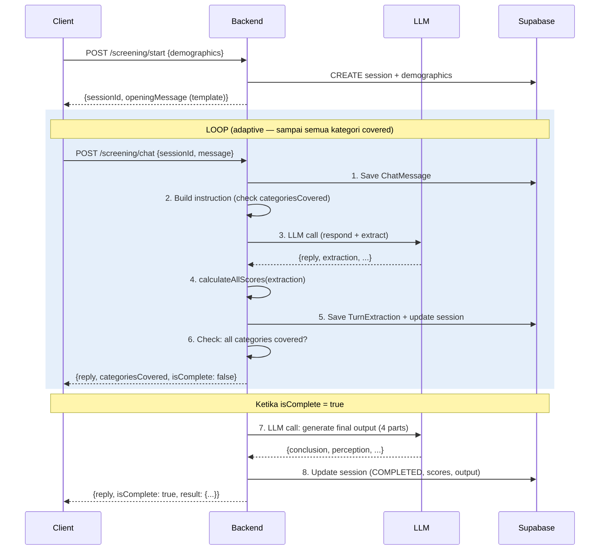

# SICAPS — Technical Specification

> **Reference:** [PRD.md](./PRD.md) | [AI_BOT_SPEC.md](./phase-1/AI_BOT_SPEC.md) | [DESIGN_SPEC.md](./phase-1/DESIGN_SPEC.md)  
> **Phase:** Fase 1 (MVP)  
> **Last updated:** 22 Juni 2026

---

## 1. Architecture Overview



---

## 2. Tech Stack

| Layer         | Technology                                          |
| ------------- | --------------------------------------------------- |
| Frontend      | Next.js 16 (App Router), React 19, Tailwind CSS     |
| UI Components | Radix UI (headless) + custom Tailwind components    |
| Backend       | Next.js API Routes (serverless)                     |
| Database      | Supabase PostgreSQL                                 |
| ORM           | Prisma                                              |
| Auth          | Supabase Auth (Fase 2)                              |
| LLM SDK       | OpenAI SDK (with custom baseURL)                    |
| Voice Input   | Web Speech API — SpeechRecognition (browser native) |
| Voice Output  | Web Speech API — speechSynthesis (browser native)   |
| PDF           | @react-pdf/renderer (server-side)                   |
| i18n          | next-intl                                           |
| Deployment    | Vercel (free tier)                                  |
| Region Data   | Static JSON (emsifa/api-wilayah-indonesia) [Fase 2] |

---

## 3. Project Structure

```
sicaps/
├── app/
│   ├── (public)/
│   │   ├── page.tsx                 # Landing page
│   │   ├── login/page.tsx           # Login
│   │   ├── register/page.tsx        # Register
│   │   ├── guide/page.tsx           # How to use
│   │   ├── history/page.tsx         # Screening history (localStorage)
│   │   └── screening/
│   │       ├── demographics/page.tsx # Demographics form
│   │       ├── chat/page.tsx         # Chat interface
│   │       └── result/page.tsx       # Screening result
│   ├── (dashboard)/
│   │   ├── cadre/
│   │   │   ├── page.tsx             # List respondents
│   │   │   ├── add/page.tsx         # Add respondent
│   │   │   └── [id]/page.tsx        # Respondent detail
│   │   ├── doctor/
│   │   │   ├── page.tsx             # Review queue
│   │   │   └── review/[id]/page.tsx # Review form
│   │   └── admin/
│   │       ├── page.tsx             # Overview
│   │       ├── approval/page.tsx    # Approve cadre/doctor
│   │       └── export/page.tsx      # Export data
│   ├── api/
│   │   ├── health/
│   │   │   └── route.ts             # LLM availability check
│   │   ├── auth/
│   │   │   └── [...supabase]/route.ts
│   │   ├── screening/
│   │   │   ├── start/route.ts       # Start session
│   │   │   ├── chat/route.ts        # Submit message / pill selection
│   │   │   ├── [id]/
│   │   │   │   └── session/route.ts # Restore chat state
│   │   │   └── result/[id]/route.ts # Get result + PDF
│   │   ├── admin/
│   │   │   ├── approve/route.ts     # Approve user
│   │   │   └── export/route.ts      # Export CSV
│   │   ├── doctor/
│   │   │   ├── queue/route.ts       # Review queue
│   │   │   └── review/route.ts      # Submit review
│   │   ├── cadre/
│   │   │   └── respondent/route.ts  # CRUD respondent
│   │   └── region/
│   │       └── route.ts             # Region data
│   └── layout.tsx
├── components/
│   ├── chat/
│   │   ├── ChatBubble.tsx
│   │   ├── ChatInput.tsx
│   │   ├── VoiceButton.tsx
│   │   └── ChatContainer.tsx
│   ├── forms/
│   │   ├── DemographicsForm.tsx
│   │   └── RegionDropdown.tsx
│   ├── dashboard/
│   │   ├── RespondentList.tsx
│   │   ├── ReviewQueue.tsx
│   │   └── ApprovalList.tsx
│   └── ui/
│       ├── Button.tsx
│       ├── Card.tsx
│       └── ...
├── db/                              # Database & external service clients
│   ├── prisma.ts                    # Prisma client instance
│   └── supabase.ts                  # Supabase client instance
├── services/                        # Business orchestration
│   ├── screening.service.ts
│   └── pdf.service.ts
├── lib/                             # Pure logic, NO I/O
│   ├── scoring/                     # Scoring engine (deterministic)
│   │   ├── engine.ts                # calculateCategoryScore, calculateAllScores, getRiskLevel
│   │   ├── pool.ts                  # KeywordPool management
│   │   ├── normalize.ts             # Normalization functions
│   │   └── matcher.ts              # Pattern matching (longest-match priority)
│   ├── keywords/                    # Keyword pattern tables per locale
│   │   ├── id.ts                    # Bahasa Indonesia patterns
│   │   ├── en.ts                    # English patterns
│   │   ├── types.ts                 # Shared types (KeywordRule, etc.)
│   │   └── index.ts                 # Barrel export
│   ├── questionnaire/
│   │   ├── pills.ts                 # Pill definitions per category per locale
│   │   └── scorer.ts               # Direct score mapping for questionnaire mode
│   ├── prompts/                     # LLM prompt templates
│   │   ├── system.ts               # getPersonaAndRules(theme, locale)
│   │   ├── context.ts              # getSessionContext(session)
│   │   ├── instruction.ts          # getBackendInstruction(state)
│   │   ├── output.ts               # getOutputSystemMessage(session, scores)
│   │   └── index.ts                # Barrel export
│   ├── llm.ts                       # LLM client config (OpenAI SDK)
│   ├── env.ts                       # Env validation (Zod)
│   ├── config.ts                    # App constants
│   ├── errors.ts                    # AppError classes
│   ├── sanitize.ts                  # Input sanitization
│   └── api/
│       └── response.ts              # API envelope helpers
├── stores/                           # Zustand stores
│   ├── screening.ts
│   └── history.ts                   # localStorage history management
├── types/                            # Shared TypeScript types
│   ├── api.ts
│   ├── screening.ts
│   └── index.ts
├── messages/                         # i18n (next-intl)
│   ├── id.json
│   └── en.json
├── prisma/
│   └── schema.prisma
├── data/
│   └── regions/                     # Static JSON province→village
└── docs/
    ├── PRD.md
    └── TECHNICAL_SPEC.md
```

---

## 4. Database Schema

> **Single source of truth:** Lihat [DATABASE_SCHEMA.md](./DATABASE_SCHEMA.md) untuk definisi lengkap semua model, indexes, RLS policies, dan JSON field schemas.

### 4.1 MVP Models (Ringkasan)

| Model              | Deskripsi                       | Key Fields                                                                          |
| ------------------ | ------------------------------- | ----------------------------------------------------------------------------------- |
| `ScreeningSession` | Root entity per sesi            | `id`, `locale`, `mode`, `status`, `scores`, `totalScore`, `riskLevel`, `shareToken` |
| `Demographics`     | Data demografi 1:1 session      | `name?`, `age`, `gender`, `educationLevel`                                          |
| `ChatMessage`      | Transcript per bubble           | `role`, `content`, `isVoice`                                                        |
| `TurnExtraction`   | Extraction audit trail per turn | `turnNumber`, `extraction` (JSONB), `scores` (JSONB)                                |

### 4.2 Fase 2 Models (Planned)

| Model            | Deskripsi                                 |
| ---------------- | ----------------------------------------- |
| `User`           | Auth + roles (Admin, Doctor, Cadre, User) |
| `DoctorReview`   | Review dokter per session                 |
| `Respondent`     | Santri yang dikelola kader                |
| `ScreeningImage` | Upload foto untuk CV analysis             |
| `CadreLocation`  | Profil lokasi pondok                      |

> **Schema Prisma lengkap (copy-paste ready):** DATABASE_SCHEMA.md §13

---

## 5. API Design

### 5.1 Screening (MVP)

| Method | Endpoint                        | Description                                                                   |
| ------ | ------------------------------- | ----------------------------------------------------------------------------- |
| GET    | `/api/health`                   | LLM availability check — frontend hits on page load                           |
| POST   | `/api/screening/start`          | Start new session → return sessionId + opening message (template)             |
| POST   | `/api/screening/chat`           | Main endpoint: submit message/pills → LLM (respond+extract) → score → respond |
| GET    | `/api/screening/:id/session`    | Restore chat state on page refresh (requires shareToken)                      |
| GET    | `/api/screening/result/:id`     | Get result by sessionId (public, requires shareToken)                         |
| GET    | `/api/screening/result/:id/pdf` | Download PDF (requires shareToken)                                            |

> **Full endpoint specification:** Lihat [API_SPEC.md](./phase-1/API_SPEC.md) untuk request/response schemas, error codes, rate limits, dan questionnaire mode.

#### `POST /api/screening/start`

Request:

```json
{
  "demographics": {
    "name": "Ahmad",
    "age": 14,
    "gender": "male",
    "educationLevel": "junior_high"
  },
  "locale": "id"
}
```

Response:

```json
{
  "sessionId": "uuid",
  "shareToken": "uuid",
  "theme": "hybrid",
  "openingMessage": "Halo! Saya SICAPS 👋 Saya akan bantu memahami keluhan kulit yang kamu rasakan. Bisa ceritakan, apa yang sedang kamu alami?"
}
```

#### `POST /api/screening/chat`

Request:

```json
{
  "sessionId": "uuid",
  "message": "Gatal banget kak, di sela jari tangan, makin parah pas malam.",
  "isVoice": false
}
```

Response (mid-screening):

```json
{
  "reply": "Oke, gatal banget ya. Ada orang lain di sekitarmu yang juga mengalami gatal serupa?",
  "status": "in_progress",
  "categoriesCovered": ["intensitas", "lokasi_tubuh", "waktu"],
  "isComplete": false
}
```

Response (completed):

```json
{
  "reply": "Terima kasih sudah menjawab semua pertanyaan. Berikut hasil screening kamu:",
  "status": "completed",
  "isComplete": true,
  "result": {
    "totalScore": 8,
    "riskLevel": "HIGH",
    "scores": {
      "intensitas": 2,
      "waktu": 2,
      "lokasi_tubuh": 2,
      "kontak": 2,
      "lesi": 0,
      "faktor_risiko": 0
    },
    "conclusion": "...",
    "perceptionResponse": "...",
    "recommendation": "...",
    "personalizedSuggestion": "..."
  }
}
```

#### `GET /api/screening/result/:id?token=:shareToken`

Public endpoint — no auth required, validated by shareToken.

Response:

```json
{
  "sessionId": "uuid",
  "completedAt": "2026-06-22T14:30:00Z",
  "demographics": { "age": 14, "gender": "male", "educationLevel": "junior_high" },
  "totalScore": 8,
  "riskLevel": "HIGH",
  "scores": { "intensitas": 2, "waktu": 2, ... },
  "conclusion": "...",
  "perceptionResponse": "...",
  "recommendation": "...",
  "personalizedSuggestion": "..."
}
```

### 5.2 — 5.6 Authentication, Admin, Doctor, Cadre, Region (Fase 2)

> Lihat [phase-2/API_ENDPOINTS.md](./phase-2/API_ENDPOINTS.md)

---

## 6. LLM Integration

### 6.1 Provider Abstraction

```typescript
// lib/llm.ts
import OpenAI from 'openai';

export const llm = new OpenAI({
  baseURL: process.env.LLM_BASE_URL,
  apiKey: process.env.LLM_API_KEY,
});

export const LLM_MODEL = process.env.LLM_MODEL || 'qwen2.5:7b';
```

### 6.2 Environment Variables

```env
# Development (Ollama local)
LLM_BASE_URL=http://localhost:11434/v1
LLM_API_KEY=ollama
LLM_MODEL=qwen2.5:7b

# MVP (Hugging Face via router)
LLM_BASE_URL=https://router.huggingface.co/v1
LLM_API_KEY=hf_xxxxxxxxxx
LLM_MODEL=Qwen/Qwen2.5-7B-Instruct

# Production (Self-deployed)
LLM_BASE_URL=https://your-server.com/v1
LLM_API_KEY=your-secret-key
LLM_MODEL=qwen2.5:7b

# Alternative (OpenAI)
# LLM_BASE_URL=https://api.openai.com/v1
# LLM_API_KEY=sk-xxxxxxxxxx
# LLM_MODEL=gpt-4o-mini

# Alternative (Groq)
# LLM_BASE_URL=https://api.groq.com/openai/v1
# LLM_API_KEY=gsk-xxxxxxxxxx
# LLM_MODEL=llama-3.1-8b-instant
```

### 6.3 System Prompts

> **Full prompt templates:** Lihat [AI_BOT_SPEC.md — Appendix A](./phase-1/AI_BOT_SPEC.md) untuk template lengkap.

Prompts di-manage di `lib/prompts.ts`:

```typescript
// lib/prompts.ts

/**
 * System prompt — static, injected once per LLM call.
 * Contains: persona, language rules, output format, safety guardrails.
 * Parameterized by theme and language.
 */
export function getSystemPrompt(theme: 'playful' | 'hybrid', language: 'id' | 'en'): string;

/**
 * Session context — dynamic, changes per session.
 * Contains: education_level, age, gender, extraction state, turn count.
 */
export function getSessionContext(session: ScreeningSession): string;

/**
 * Backend instruction — dynamic, changes per turn.
 * Examples: "Tanyakan tentang: waktu", "Follow-up: kontak (low confidence)"
 */
export function getBackendInstruction(
  categoriesCovered: string[],
  nextCategory: string | null,
): string;

/**
 * Final output prompt — used when all categories covered.
 * Generates: conclusion, perception response, recommendation, personalized suggestion.
 */
export function getOutputPrompt(session: ScreeningSession, scores: Record<string, number>): string;
```

**LLM Output format (JSON mode):**

```json
{
  "reply": "<balasan natural ke user>",
  "extraction": {
    "intensitas": [{ "keyword": "...", "confidence": "high|medium|low" }],
    "waktu": [...],
    "lokasi_tubuh": [...],
    "kontak": [...],
    "lesi": [...],
    "faktor_risiko": [...]
  },
  "categories_covered": ["..."],
  "next_category": "..." | null,
  "should_follow_up": true | false
}
```

---

## 7. Scoring Engine

> **Single source of truth:** Lihat [SCORING_ENGINE_SPEC.md](./phase-1/SCORING_ENGINE_SPEC.md) untuk algoritma lengkap, pattern tables, keyword pool management, questionnaire mode scoring, dan worked examples.

### 7.1 Summary

| Aspek                | Deskripsi                                                                        |
| -------------------- | -------------------------------------------------------------------------------- |
| Pipeline             | LLM extract keywords → backend normalize → match pattern table → calculate score |
| Confidence filtering | Only `high` + `medium` keywords enter scoring. `low` excluded until confirmed.   |
| Matching             | Substring matching, longest-match priority, cumulative, unique per pattern       |
| Floor                | 0 per category (negative keywords reduce but never below 0)                      |
| Risk thresholds      | ≥7 HIGH, 4–6 MODERATE, ≤3 LOW                                                    |
| Questionnaire mode   | Pills have predefined scores, sum kumulatif per category, same thresholds        |
| Locale               | Pattern tables per locale (ID/EN). Logic identical, only strings differ.         |
| Recalculation        | Full recalculate from entire keyword pool every turn (not incremental)           |

### 7.2 Key Functions

```typescript
// lib/scoring/engine.ts

/** Calculate score for one category from keyword pool. */
export function calculateCategoryScore(
  extractedKeywords: ExtractedKeyword[],
  category: string,
  locale: Locale,
): CategoryScore;

/** Calculate scores for all categories from a turn extraction. */
export function calculateAllScores(
  extraction: CategoryExtraction,
  locale: Locale,
): Record<string, CategoryScore>;

/** Determine risk level from total score. */
export function getRiskLevel(totalScore: number): RiskLevel;
```

### 7.3 Risk Level Thresholds

| Total Score | Level    | Interpretation                        |
| ----------- | -------- | ------------------------------------- |
| ≥ 7         | HIGH     | Kemungkinan besar skabies             |
| 4 – 6       | MODERATE | Curiga skabies, perlu evaluasi lanjut |
| ≤ 3         | LOW      | Kemungkinan kecil skabies             |

> **Keyword tables (ID):** [PRD.md §3.5](./PRD.md)  
> **Keyword tables (EN):** [BILINGUAL_SPEC.md §3](./phase-1/BILINGUAL_SPEC.md)  
> **Full algorithm + worked examples:** [SCORING_ENGINE_SPEC.md](./phase-1/SCORING_ENGINE_SPEC.md)

---

## 8. Screening Flow (Sequence)



**Key points:**

- Opening message is template (no LLM call)
- Each turn: 1 LLM call (combined respond + extract)
- Backend decides next category based on extraction state
- Loop ends when all 6 categories have `medium`+ confidence coverage
- Final output: 1 additional LLM call to generate 4-part result

---

## 8.5 Screening History (Client-Side)

Phase 1 (MVP) menyimpan riwayat screening di **localStorage** browser. Tanpa user account, ini satu-satunya cara user bisa kembali melihat hasil.

### localStorage Schema

```typescript
// stores/history.ts

const STORAGE_KEY = 'sicaps_history';
const EXPIRY_DAYS = 30;

interface ScreeningRecord {
  sessionId: string;
  shareToken: string;
  createdAt: string; // ISO 8601
  completedAt: string; // ISO 8601 (selalu ada — hanya completed sessions)
  riskLevel: 'HIGH' | 'MODERATE' | 'LOW';
  totalScore: number;
  mode: 'ai' | 'questionnaire';
  locale: 'id' | 'en';
}

// Stored as JSON array
type ScreeningHistory = ScreeningRecord[];
```

### Lifecycle

| Event                               | Action                                                        |
| ----------------------------------- | ------------------------------------------------------------- |
| Session completed (result received) | Append record ke localStorage                                 |
| User opens `/history`               | Read + filter expired (>30 hari) + render list                |
| User taps "Hapus Semua"             | Clear `STORAGE_KEY` dari localStorage                         |
| Auto-expire check                   | On page load, remove records where `createdAt` > 30 hari lalu |

### Auto-Expire Logic

```typescript
export function getHistory(): ScreeningRecord[] {
  const raw = localStorage.getItem(STORAGE_KEY);
  if (!raw) return [];

  const records: ScreeningRecord[] = JSON.parse(raw);
  const now = Date.now();
  const maxAge = EXPIRY_DAYS * 24 * 60 * 60 * 1000;

  // Filter expired
  const valid = records.filter((r) => now - new Date(r.createdAt).getTime() < maxAge);

  // Write back cleaned list
  if (valid.length !== records.length) {
    localStorage.setItem(STORAGE_KEY, JSON.stringify(valid));
  }

  return valid;
}
```

### Halaman `/history`

| Aspek            | Detail                                                                                         |
| ---------------- | ---------------------------------------------------------------------------------------------- |
| Route            | `app/(public)/history/page.tsx`                                                                |
| Data source      | `lib/history.ts` → localStorage                                                                |
| Empty state      | "Belum ada riwayat screening" + CTA mulai baru                                                 |
| Item display     | Tanggal, risk badge (warna), skor, mode                                                        |
| Actions per item | "Lihat Hasil" (→ result page), "Lihat Chat" (→ read-only chat)                                 |
| Footer           | Tombol "Hapus Semua Riwayat" (confirm dialog)                                                  |
| Note             | "Riwayat hanya tersimpan di perangkat ini. Gunakan mode Incognito jika tidak ingin tersimpan." |

### Privacy Design

- Data **hanya** tersimpan di device user (localStorage) — tidak dikirim ke server
- Auto-expire 30 hari — tidak menumpuk selamanya
- Tombol "Hapus Semua" prominent di halaman riwayat
- Note: "Gunakan private/incognito browser jika tidak ingin tersimpan"
- Tidak menyimpan data sensitif (nama, konten chat) di localStorage — hanya ID + metadata
- Untuk melihat chat/hasil, tetap perlu fetch dari server (require shareToken)

### Phase 2 Migration

Saat Phase 2 (user accounts):

1. User login → frontend kirim localStorage records ke backend
2. Backend verify setiap `sessionId + shareToken` pair
3. Backend link verified sessions ke `userId`
4. Frontend clear localStorage setelah migration sukses
5. Halaman `/history` switch data source: localStorage → API endpoint

---

## 9. Security

### 9.1 Rate Limiting

```typescript
// middleware/rateLimit.ts
import { Ratelimit } from '@upstash/ratelimit';
import { Redis } from '@upstash/redis';

const ratelimit = new Ratelimit({
  redis: Redis.fromEnv(),
  limiter: Ratelimit.slidingWindow(10, '1 m'), // 10 requests per minute
});

// Apply to /api/screening/chat (contains LLM calls)
// See API_SPEC.md §4 for per-endpoint rate limits
```

### 9.2 Role-Based Access Control

```typescript
// middleware/auth.ts
export function withRole(allowedRoles: Role[]) {
  return async (req: Request) => {
    const user = await getCurrentUser(req);
    if (!user || !allowedRoles.includes(user.role)) {
      return Response.json({ error: 'Unauthorized' }, { status: 403 });
    }
    if (['DOCTOR', 'CADRE'].includes(user.role) && user.approvalStatus !== 'APPROVED') {
      return Response.json({ error: 'Account pending approval' }, { status: 403 });
    }
  };
}
```

### 9.3 Input Validation

- Zod schema validation on all API inputs
- Sanitize user text input before sending to LLM
- Validate JSON response from LLM before processing

---

## 10. Voice Integration

> **Full voice spec:** Lihat [AI_BOT_SPEC.md §13](./phase-1/AI_BOT_SPEC.md) untuk detail TTS settings, mode operasi, dan visual feedback.

### 10.1 Voice Input (STT)

```typescript
// components/chat/VoiceInput.tsx
const SpeechRecognition = window.SpeechRecognition || window.webkitSpeechRecognition;

const recognition = new SpeechRecognition();
recognition.lang = locale === 'en' ? 'en-US' : 'id-ID';
recognition.continuous = false;
recognition.interimResults = true;

// On result → set text input → user reviews → manual send
```

- Tap 🎤 → start recognition → transkrip muncul di input field
- User review/edit → tekan send manual
- Fallback: if browser doesn't support → hide 🎤 button

### 10.2 Voice Output (TTS)

```typescript
// lib/tts.ts
export function speak(text: string, theme: 'playful' | 'hybrid', locale: string) {
  if (!window.speechSynthesis) return;

  // Strip emoji before speaking
  const cleanText = text.replace(/[\u{1F600}-\u{1F9FF}]/gu, '').trim();

  const utterance = new SpeechSynthesisUtterance(cleanText);
  utterance.lang = locale === 'en' ? 'en-US' : 'id-ID';
  utterance.rate = theme === 'playful' ? 0.85 : 0.95;
  utterance.pitch = theme === 'playful' ? 1.1 : 1.0;

  window.speechSynthesis.speak(utterance);
}
```

**Two modes:**

- **On-demand:** Long-press bubble AI (~300ms) → play that bubble
- **Full-voice mode:** Toggle 🔊 di input area → auto-play all new bubbles + auto-STT after TTS ends

**Graceful degradation:** If `speechSynthesis` not available → hide 🔊 toggle entirely.

---

## 11. Deployment

### 11.1 Vercel Configuration

```json
// vercel.json
{
  "regions": ["sin1"],
  "headers": [
    {
      "source": "/api/(.*)",
      "headers": [
        { "key": "X-Content-Type-Options", "value": "nosniff" },
        { "key": "X-Frame-Options", "value": "DENY" },
        { "key": "X-XSS-Protection", "value": "1; mode=block" },
        { "key": "Referrer-Policy", "value": "strict-origin-when-cross-origin" }
      ]
    }
  ]
}
```

> **Note:** Menggunakan Vercel Hobby (free tier). Chat endpoint menggunakan streaming (`ReadableStream`) untuk bypass 10s function timeout. Lihat [LLM_INTEGRATION.md §4](./phase-1/LLM_INTEGRATION.md) untuk detail streaming implementation dan [DEPLOYMENT.md §4](./DEPLOYMENT.md) untuk konfigurasi lengkap.

### 11.2 Environment Variables (Vercel)

```env
# Database
DATABASE_URL=postgresql://...@supabase.co:5432/postgres

# Supabase
NEXT_PUBLIC_SUPABASE_URL=https://xxx.supabase.co
NEXT_PUBLIC_SUPABASE_ANON_KEY=xxx
SUPABASE_SERVICE_ROLE_KEY=xxx

# LLM
LLM_BASE_URL=https://router.huggingface.co/v1
LLM_API_KEY=hf_xxx
LLM_MODEL=Qwen/Qwen2.5-7B-Instruct

# Rate Limiting (Upstash)
UPSTASH_REDIS_REST_URL=xxx
UPSTASH_REDIS_REST_TOKEN=xxx
```

---

## 12. Development Setup

```bash
# 1. Clone & install
git clone <repo>
cd sicaps
npm install

# 2. Setup environment
cp .env.example .env.local
# Edit .env.local with your values

# 3. Setup database
npx prisma generate
npx prisma db push

# 4. Start Ollama (for local LLM)
ollama pull qwen2.5:7b
ollama serve

# 5. Run development server
npm run dev
```

---

## 13. MVP Scope (Minimal)

MVP only includes:

- **Landing page** (title, description, disclaimer, "Start Screening" + "How to Use" buttons, lang toggle ID/EN)
- **Demographics form** (1 step: name, age, gender, education level — anonymous, no login)
- **Chat screening** (adaptive flow, bubble chat + voice input + voice output TTS)
- **LLM integration** (1 call per turn: combined respond + extract, structured JSON output)
- **Confidence scoring** (3-level: high/medium/low, affects scoring eligibility)
- **Scoring engine** (confidence-aware: filter → match → cumulative → floor 0)
- **Result output** (4 parts: conclusion, perception response, recommendation, personalized suggestion)
- **Result detail page** (score circle + breakdown per category + 4 outputs + disclaimer)
- **Shareable result link** (token-based public access)
- **PDF download** (scores + keyword summary + 4 outputs + YARSI header)
- **Data persistence** to Supabase (session + turn extractions + chat messages + demographics)
- **Bilingual** (Indonesian + English) — see [BILINGUAL_SPEC.md](./phase-1/BILINGUAL_SPEC.md)
- **LLM via HuggingFace Inference API** (Qwen2.5-7B-Instruct)

NOT included in MVP:

- Login/Register/Auth system
- Role management (Admin, Doctor, Cadre)
- Any dashboard
- Incognito mode (needs auth)
- Admin approval
- Doctor review
- Cadre respondent management
- Region/location data (kader feature)
- Data export
- Statistics/Map
- Image assessment

MVP database models used:

- `ScreeningSession` (without userId — pure anonymous)
- `TurnExtraction` (per-turn audit trail)
- `ChatMessage` (full transcript)
- `Demographics` (4 fields only)

Fields prepared for Fase 2 (in schema but unused in MVP):

- `ScreeningSession.userId`
- `ScreeningSession.isIncognito`
- `ScreeningSession.shareToken` (used in MVP for public links)

---

## 14. Testing Strategy

| Layer       | Tool         | Focus                                                  |
| ----------- | ------------ | ------------------------------------------------------ |
| Unit        | Vitest       | Scoring engine, keyword matching, confidence filtering |
| Integration | Vitest + MSW | API routes, LLM mocking, extraction pipeline           |
| E2E         | Playwright   | Full screening flow (form → chat → result)             |

Priority test cases:

1. Scoring engine: all keyword combinations, confidence filtering, negative keywords, floor, longest match
2. Screening flow: adaptive category tracking, follow-up logic, completion detection
3. LLM extraction: mock responses, confidence parsing, error handling
4. Voice: STT/TTS fallback behavior when unsupported
5. Shareable links: token validation, public access
6. PDF generation: correct content rendering
